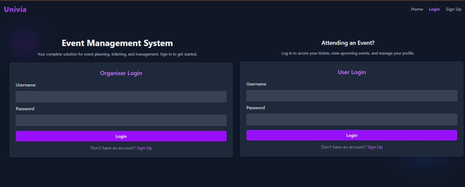
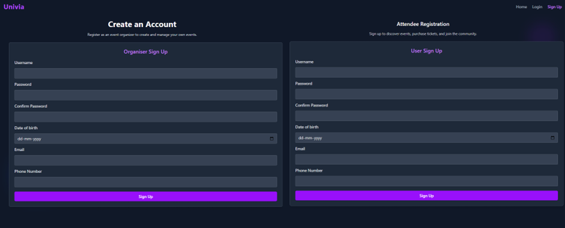
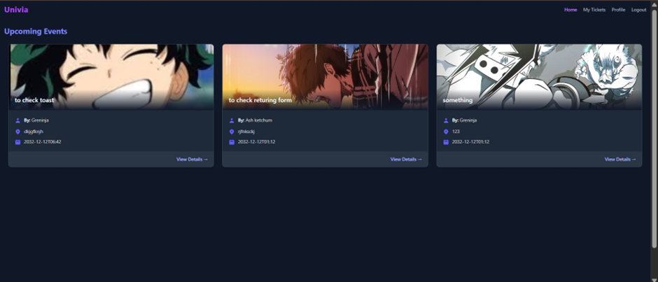
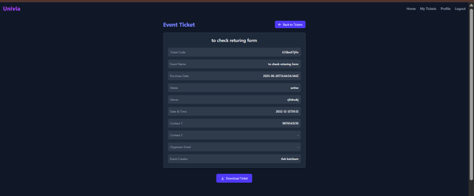
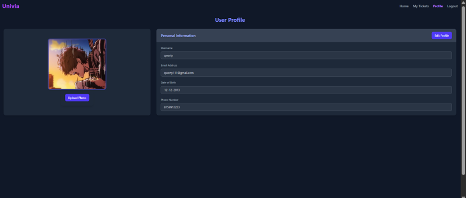
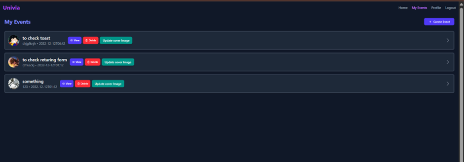
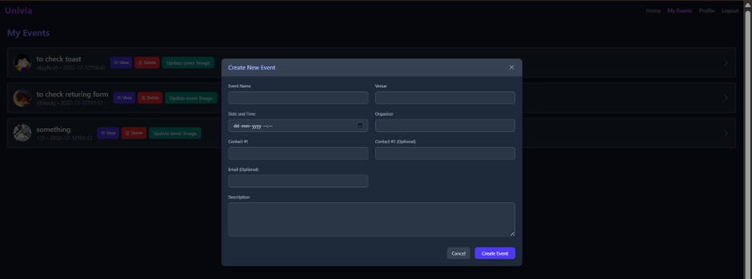

# Univia

**Univia** is a full-stack event ticketing platform where users can browse, register, and manage events — while organizers can create, edit, and control participation seamlessly.

---

## 🚀 Features

- 🔐 **JWT Auth** for secure login/signup  
- 📩 **Email OTP verification** before registration  
- 🗓️ **Create & edit events** with datetime support  
- 📬 **Smart ticketing system** (tickets tied to event + user)  
- 🧾 **Ticket download** with printable view  
- 📥 **Event image uploads** (Cloudinary integration)  
- 👥 **Role-based access**: users vs organizers  

---

## 🛠️ Tech Stack

- **Frontend:** React, TailwindCSS, Axios, React Hot Toast  
- **Backend:** Node.js, Express.js, MongoDB, Mongoose  
- **Auth:** JWT, bcrypt  
- **Media:** Cloudinary  
- **Email:** Nodemailer  

---

## 📌 Developer Notes

- OTP verification entries are stored in a separate collection with a 5-minute TTL.
- If a user enters the wrong OTP, no user account is created.
- Ticket records tied to deleted events are cleaned up automatically.
- Organizers can restrict registrations using max participant limits and email regex rules.
- Authenticated routes are protected with JWTs.
- Event images are stored on Cloudinary and old ones are deleted on update.

---

## 🧩 API Documentation

### Auth & User

#### `POST /api/v1/user/send-otp`
- **Purpose:** Start signup, send OTP to email.
- **Body:** `{ username, password, confirmPassword, dob, email, phoneNumber }`
- **Response:** `{ verificationId }`

#### `POST /api/v1/user/signUp`
- **Purpose:** Complete signup with OTP.
- **Body:** `{ verificationId, otp }`
- **Response:** User data

#### `POST /api/v1/user/login`
- **Purpose:** Login user.
- **Body:** `{ username, password }`
- **Response:** User data, sets cookies

#### `POST /api/v1/user/logout-user`
- **Purpose:** Logout user, clears cookies.

#### `GET /api/v1/user/user-details`
- **Purpose:** Get current user details (requires JWT).

#### `POST /api/v1/user/profile`
- **Purpose:** Update user profile (email, phone, dob).
- **Body:** `{ email, phoneNumber, dob }`

#### `POST /api/v1/user/update-avatar`
- **Purpose:** Update user avatar (multipart/form-data, field: `avatar`).

#### `POST /api/v1/user/refresh-access-token`
- **Purpose:** Refresh JWT using refresh token cookie.

---

### Events

#### `POST /api/v1/event/create-event`
- **Purpose:** Organizer creates an event.
- **Body:** `{ eventName, venue, dateTime, description, organiserName, contact1, contact2, organiserEmailId, eventCreater, eventLaunched }`

#### `GET /api/v1/event/user-events`
- **Purpose:** Get all events created by the organizer.

#### `PATCH /api/v1/event/edit-event`
- **Purpose:** Edit an event (organizer only).
- **Body:** Same as create-event, plus `eventId`.

#### `GET /api/v1/event/launched-events`
- **Purpose:** Get all launched (public) events.

#### `DELETE /api/v1/event/delete-event`
- **Purpose:** Delete an event.
- **Body:** `{ eventId }`

#### `PATCH /api/v1/event/event-image`
- **Purpose:** Update event image (multipart/form-data, field: `eventImage`).

---

### Tickets

#### `POST /api/v1/ticket/register-event`
- **Purpose:** User registers for an event.
- **Body:** `{ eventId }`
- **Response:** Ticket data

#### `GET /api/v1/ticket/get-tickets`
- **Purpose:** Get all tickets for the logged-in user.

#### `PATCH /api/v1/ticket/delete-ticket`
- **Purpose:** Hide/delete a ticket from user view.
- **Body:** `{ ticketCode }`

---

### Healthcheck

#### `GET /api/v1/healthcheck`
- **Purpose:** Returns API health status.

---

## Preview









## 🧪 Running Locally

```bash
# Backend
cd eventBackend
npm install
npm run dev

# Frontend
cd eventFrontend
npm install
npm run dev